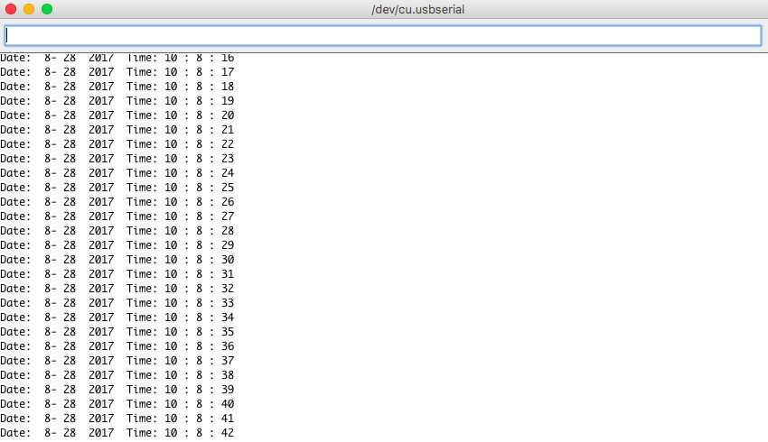

## Examples' pictures:

####  STM32F103C8 Blackpill ( PB12) 
  1. Serialport set and display RTC clock. based on https://github.com/rogerclarkmelbourne/Arduino_STM32
  
      . 1st step change to your timezone in the sketch;
      . next step get Unix epoch time from https://www.epochconverter.com/ ;
      . last step input the 10 bits number( example: 1503945555) to Serialport ;
      . the clock will be reset to you wanted;
      . use timelib library.
      
  

  2. Use new RTClock library of STM32F103, add Weekday. Others same function as 1.
  
 
